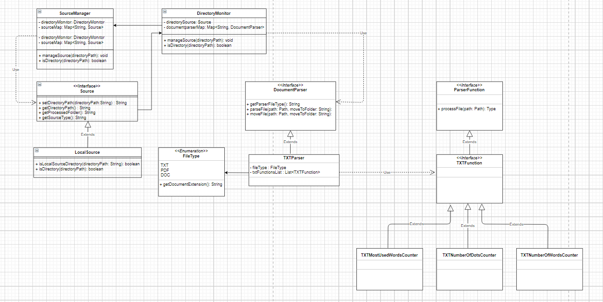

# Contacts Application

### About
DocumentParser App constantly monitors the files of the provided source folder for changes and modifications, performs the required operations and displays the results. 

### Requirements

In order to build and run the application you will need:

* Java 11

### How to build and run

Perform below commands to build the application:
```
mvn clean package
```
In order to run the application run the command below with directory path:
```
java -jar DocumentParser-0.0.1-SNAPSHOT.jar "D:/TEST"
```
or, if you will not provide the directory path as an argument, you will be prompted to input it later.
```
java -jar DocumentParser-0.0.1-SNAPSHOT.jar"
```

Supported source type, file type and operations on that file type are given below. All of these features can be extended by implementing the appropriate interfaces and providing the implementations.
```
Source type: Local source
File type (extension): .txt files
Operations: Number of words in the file,
            Number of dots in the file,
            Most used word in the file 
```
UML diagram of the application:

